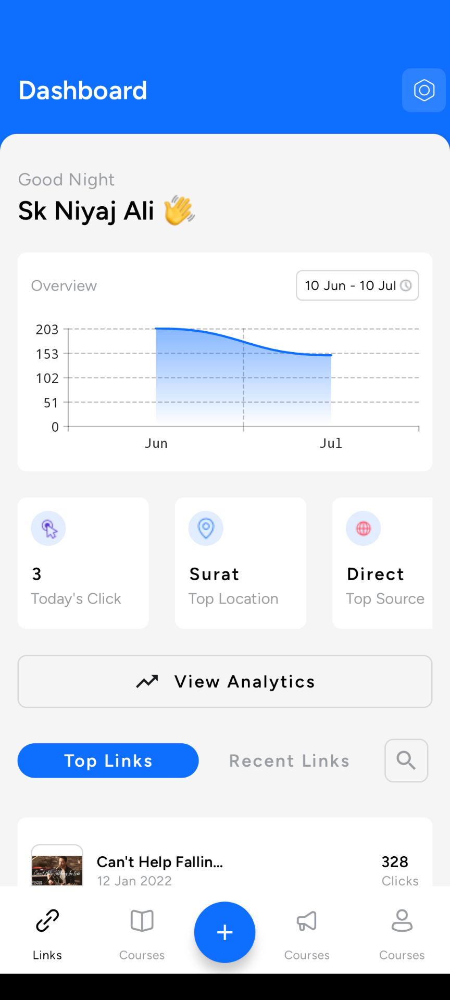
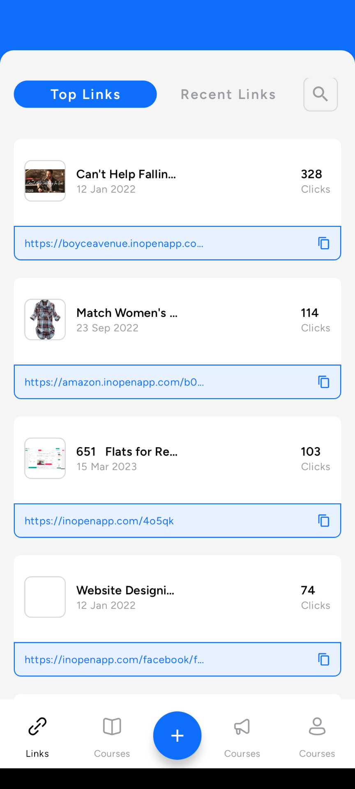
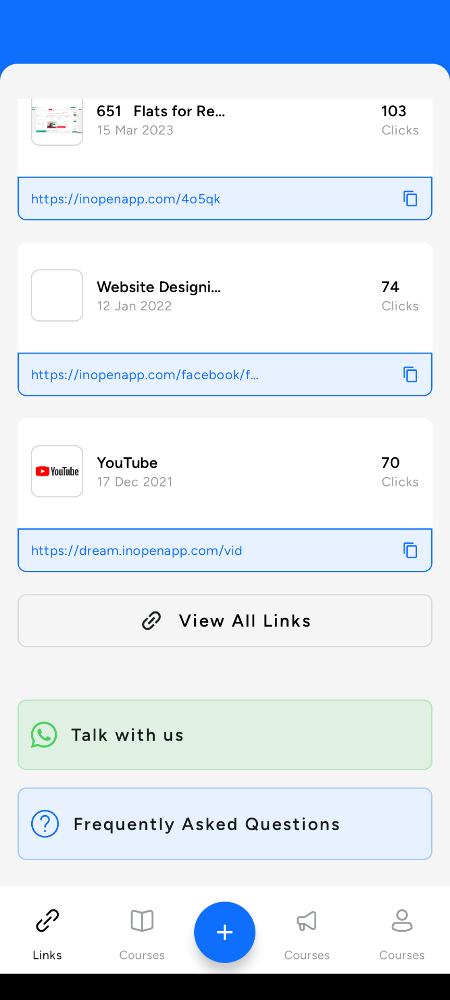

# Dashboard UI

- Language - Android, Kotlin
- Framework - Jetpack Compose
- Design - Material 3 & Custom Design
- Architecture - MVVM(Clean Architecture)

# --------------------------------------------------------

|                                               |                                               |                                               |
|-----------------------------------------------|-----------------------------------------------|-----------------------------------------------|
|  |  |  |
